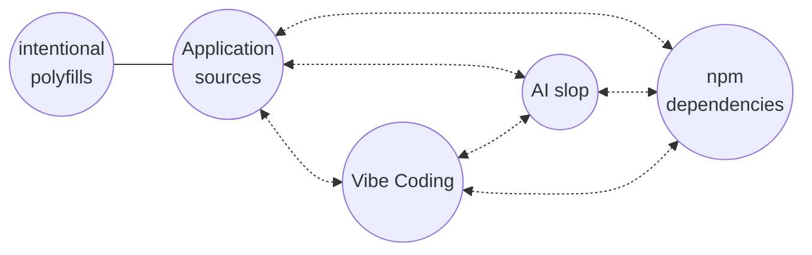

# new Global

#### status update & feedback request

_Zbyszek Tenerowicz (ZTZ) @naugtur.pl_
_Kris Kowal (KKL) @kriskowal_

---

## Problem statement

Minimal addition to the spec sufficient for implementing various ideas around lightweight isolation, including Compartment, in user code.

---

## Motivation

- Domain Specific Languages
- Test runners
- Shim builtin modules
- Principle of Least Authority (Compartment)
- Emulating another host
- Isolation of unreliable code (AI)

---

## Tentative design

```js
const newGlobal = new globalThis.Global();
```

Introduce a level of indirection between _Execution Context_ and _Realm_ called _Global_ that intercepts or relieves the _Realm_ of its [[GlobalObject]], [[TemplateMap]], and [[LoadedModules]] such that multiple _Globals_ can share a realm and _most_ of their [[Intrinsics]].

_This is the only remaining language mechanism necessary to isolate scripts and ESM, with the assistance of JavaScript user code._

---

## Differences with other approaches

_Compared to Shadow Realm or exposing an Isolate factory_

- minimize intersection with the web standards
- enables isolation that doesn't undermine synchronous communication and shared prototypes
- avoids introducing a new kind of global object, instead enabling the creation of shallow copies
- while use cases may seem similar, this proposal being same-realm and avoiding duplicating large objects should allow finer-grain isolation/encapsulation

---

### Example - DSL

```js
const dslGlobal = const new Global();
dslGlobal.describe = () => {};
dslGlobal.before = () => {};
dslGlobal.after = () => {};

const source = await import.source(entrypoint);
await dslGlobal.eval('s => import(s)')(source);
```

```js
dslGlobal.document = mockDomApi;
```

Currently, Node.js `vm` module is used by some test runners (otherwise) all code including dependencies can define tests)

---

### Isolation and AI

- AI agents generating code are here to stay
- Actors producing code in an application not aligned on intentions

`new Global` + freezing intrinsics

- Encapsulate AI code to avoid it coming up with matching globals elsewhere or producing misguided attempts at polyfills inline
- Doesn't need to be security-grade isolation to contain impact of faulty code
- Generated code can interact, import and call functions regardless of the isolation

---

#### Isolation by actor


<!--

-->

---

### Emulating another host

- https://webcontainers.io/
- varius web IDEs
- use of Node.js built-ins in other environments
- DOM emulation in test runners

---

## `new Global`

```ts
interface Global {
  constructor({
    keys?: string[],
    importHook?: ImportHook,
    importMetaHook?: ImportMetaHook,
  })
  // Unique to the new global:
  Global: typeof Global,
  eval: typeof eval,
  Function: typeof Function, // with shared Function.prototype
  // internal slots for *Function as well

  // + properties copied from globalThis filtered by keys
}
```

---

### Properties

<style scoped>section{font-size:30px;}</style>

- minimum change sufficient for implementing `Compartments` in user code.
- avoids adding new concepts (eg.`Evaluators`), reuses existing `Global` concept.
- no new categories of global object, just replicas
- host creates the global object
- not opinionated on minimal set of properties

<style scoped>blockquote{font-size:20px;}</style>

> `Global` picks up from the previous proposal for `Evaluators` and results from an observation that an object conveniently containing all evaluators alreaedy exists in the spec and all we need to do is expose a constructor for it.
> It also eliminates the concern where evaluators accepting any globalThis to use would clash with the host implementation's desire to use special objects only the host can create.
> No API to set a custom reference as global context for evaluators if it's not created via `new Global`
> When a new global is created it inherits all properties from parent global unless user specifies a list. Spec offers no opinions on minimal global, only demands that all evaluators are present.

---

#### We believe all further slides are post Stage 1 concerns

We are bringing up the details for feedback

---

### Details

- allows mutating `new globalThis.Global()` before evaluation
- by default copy all properties from `globalThis`
- properties: `Global` and all evaluators have their internal slots relating them to the new _global_, that includes all [[\*Function]] slots.

```js
Reflect.getIntrinsic("%AsyncFunction%") !==
  new Global().Reflect.getIntrinsic("%AsyncFunction%");

(async () => {}).constructor ===
  new Global().eval("async () => {}").constructor;
```

---

### Details - prototype

- By default the new global would get the same prototype as parent
- The [[Prototype]] **MUST** be settable

```js
const newGlobal = new Global();
Object.setPrototypeOf(newGlobal, Object.prototype);
```

---

#### Details - All properties grafted by default

```js
globalThis.x = {};
const newGlobal = new globalThis.Global();
newGlobal.Object === globalThis.Object;
newGlobal.x === globalThis.x;
```

> non-configurable properties would need to become configurable on the copy for some use cases

---

#### Details - Properties can be selectively grafted

```js
globalThis.x = {};
globalThis.y = {};
const newGlobal = new Global({
  keys: ["y"],
});
newGlobal.x === undefined;
newGlobal.y === globalThis.y;
newGlobal.Object === undefined;
```

---

#### Details - Own unique evaluators

```js
const newGlobal = new Global();
newGlobal.eval !== thisGlobal.eval;
newGlobal.Global !== thisGlobal.Global;
newGlobal.Function !== thisGlobal.Function;
newGlobal.Function.prototype === thisGlobal.Function.prototype;
```

---

#### Details - Other unique intrinsic evaluators also share prototype

```js
const newGlobal = new Global();
newGlobal.eval("Object.getPrototypeOf(async () => {})") ===
  Object.getPrototypeOf(async () => {});
newGlobal.eval("Object.getPrototypeOf(function *() {})") ===
  Object.getPrototypeOf(function* () {});
newGlobal.eval("Object.getPrototypeOf(async function *() {})") ===
  Object.getPrototypeOf(async function* () {});
```

> As far as we can tell, nobody is using these unnamed constructors to construct functions

---

#### Details - Inherits host import hook and module map

```js
const newGlobal = new Global();
const fs1 = await import("node:fs");
const fs2 = await newGlobal.eval('import("node:fs")');
fs1 === fs2; // if present
```

---

### Intersection semantics with Content Security Policy

Globals do not alter any of the mechanism established by ESM Source Phase Imports (Stage 2.7), which enables web hosts to deny evaluation of module sources.

But, for `no-unsafe-eval`, we would ask to expose first-class `import` on all global objects.

```js
globalThis.import(source);
// to be equivalent to
globalThis.eval("s => import(s)")(source);
```

---

### new Global and Module Harmony ✨

---

#### Import hook in Global

```js
const newGlobal = new Global({
  async importHook(specifier) {
    if (specifier === 'node:fs') {
      // eval twin of mock-fs
      return import.source('mock-fs.js');
    } else {
      // sharing one instance
      return import(specifier);
    }
  }
});
const fs = await newGlobal.eval('import("node:fs"))');
```

---

#### Import hook on ModuleSource

```js
const source = new ModuleSource(`
  import "node:fs";
`, {
  importHook(specifier, attributes) {
    const specifier = new URL(importSpecifier, this.url).href;
    return import.source(specifier);
    // or
    return import(specifier);
    // or
    return new ModuleSource('');
  },
  url: import.meta.url;
});
```

---

```js
const newGlobal = new Global({
  importHook(specifier) {
    log(`global ${specifier}`);
    return new ModuleSource("");
  },
});
const source = new ModuleSource(
  `
  import 'static-import';                             // local static-import
  eval('import("direct-eval-import")');               // local direct-eval-import
  globalThis.eval('import("indirect-eval-import")');  // global indirect-eval-import
  new Function('return import("function-import")');   // global function-import
`,
  {
    importHook(specifier) {
      log(`local ${specifier}`);
      return new ModuleSource("");
    },
  }
);
await newGlobal.eval("s => import(s)")(source);
```
---

To apply isolation in bundles resulting from running a build process, while under CSP with no `unsafe-eval` we may need to rely on [Module Declarations](https://github.com/tc39/proposal-module-declarations) producing an instance or a `ModuleSource` whose import via an importHook by the new global would not be considered an evaluation but a same-origin import. 
---

<!-- visual customizations -->

<style>
/* justify, unless it's just one line (first===last) */
p {
  text-align: justify;
  text-align-last: center;
}
blockquote {
  border-left: 4px solid #888;
  padding-left: 1em;
  quotes: none;
  text-align: justify;
}
blockquote * {
  text-align: justify;
  text-align-last: left;
}
blockquote::before,
blockquote::after {
  content: none;
}
</style>
